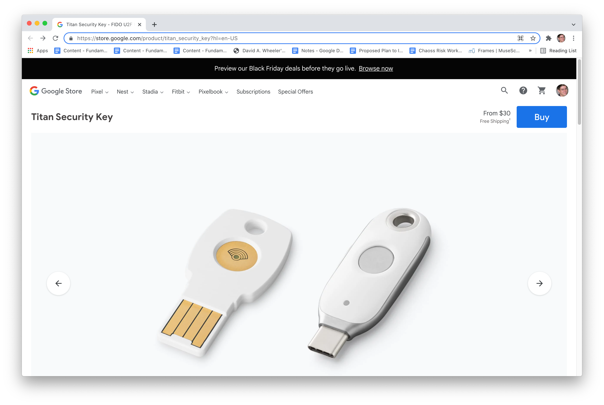
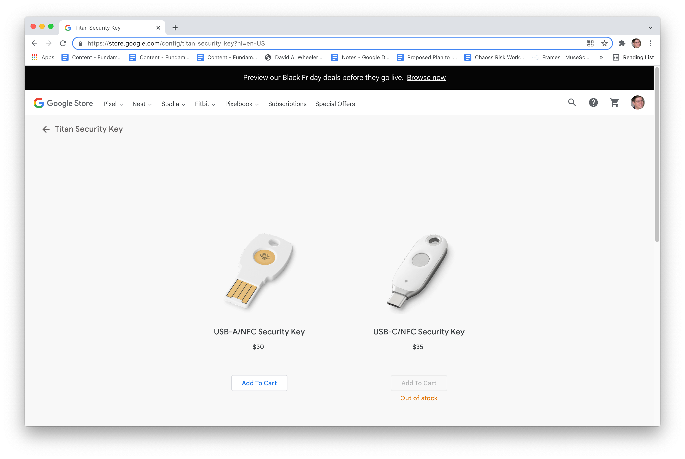
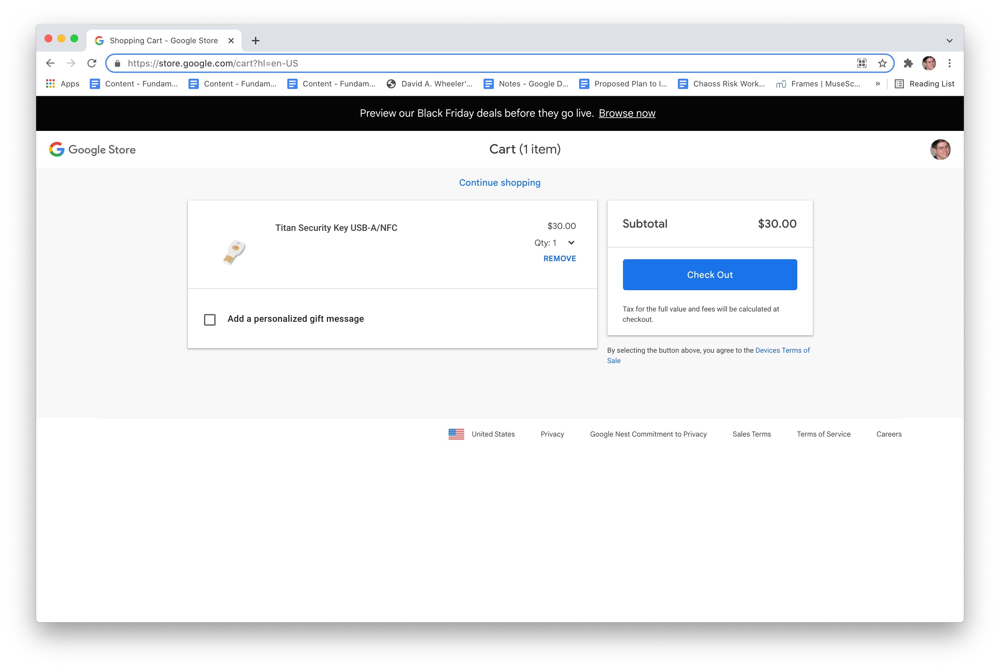

# How to get a Titan token from Google

Here is how to get an Multi-factor Authentication (MFA) Titan token from Google.
Note that tokens are also called "security keys" or "keys".

It's easy. Basically, you go to the
[Google Store's Titan key page](https://store.google.com/product/titan_security_key) and buy what you need; if you have a coupon code you can use it to get the token for free.

One caveat: These tokens are
shipped from the US, so they cannot be shipped to countries if it
is illegal to do so under US law.
Our apologies; we can’t control US law.

## Get started

To get an MFA Titan token from Google, go here:

[https://store.google.com/product/titan_security_key](https://store.google.com/product/titan_security_key)

You’ll need to create an account there if you don’t have one, 
and you’ll need to log in if you aren’t already.
We’ll skip those steps here (they're similar to systems everywhere)
and assume you’re logged in.

Once you have logged into an account, the
[Titan security key page on Google Store](https://store.google.com/product/titan_security_key)
should look like this:

<!-- Original is 3098x2078, this is 1/4 size, width is fractional -->

Now select “Buy”.

## Select a model

After you've selected "Buy"
you’ll be shown various models to choose from.
The USB-C/NFC keys weren’t available at the time these screenshots were made,
so we could only choose the USB-A/NFC keys.
That's a perfectly reasonable choice anyway, if you have USB-C
you can still use USB-A keys using a simple adapter that you probably have
anyway.
Your screen should look something like this:

Choose the model by selecting “Add To Cart” underneath the preferred model.

## Confirm the shopping cart

Once you've added a token to the cart, the store
will then show you the shopping cart contents.
Your screen should look something like this:

You don’t have to, but consider adding a “personalized gift
message” that others couldn’t guess.
That won't counter an attacker who *intercepts* the mail delivery,
but it's a zero-cost countermeasure if an attacker decided to
spray subverted tokens to many people.

Select “Check Out”. You’ll then see a checkout screen:

## Checkout

You'll now see a checkout form:

Click on “Shipping Address” and fill in your shipping address.

**Important**: Use a shipping address where you have reasonable confidence
that the token will not be tampered with at its destination nor
will tampered with along the way. For most
people, a home or business address is fine.
However, if you're concerned about interception,
consider using a special address (e.g., of someone else you trust).

If you received a coupon code, click on “Add promo code”, enter the
coupon code, and press “Apply”.  The total cost should now be $0.
*Note*: coupon codes are single use & each one gets a single token.

When we tested this, you have to enter payment information (e.g.,
credit card information) even when you use a coupon code (making
the cost $0).  That may be fixed when you read this, but just be
aware that this information may be required.

Make sure the checkbox for "Please send me Google Store special
offers and newsworthy updates." has the value you prefer. You are
*not* required to accept special offers or updates to get a token.

Once you’re done, select “Confirm purchase”.

## Checkout complete

If the checkout (purchase) fails you may see a “reload page” message.
If that happens, just follow the instructions.

If the checkout (purchase) succeeds, you’ll see a “Thanks, *NAME*” page.
We aren’t showing the page here, because it includes the shipping address.
The page will also show the expected delivery time.

When you receive the token, make sure it includes the “gift” message you set
if you set one.
