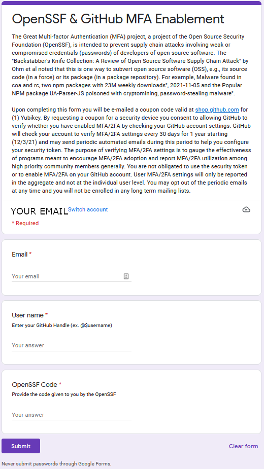
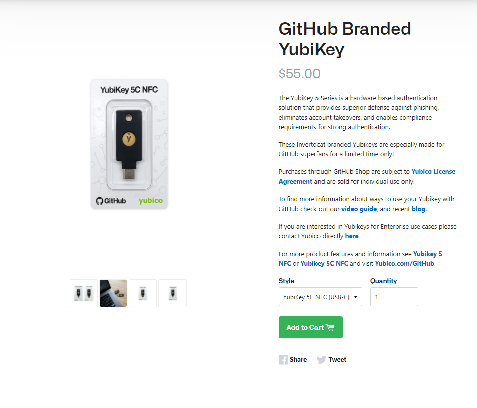
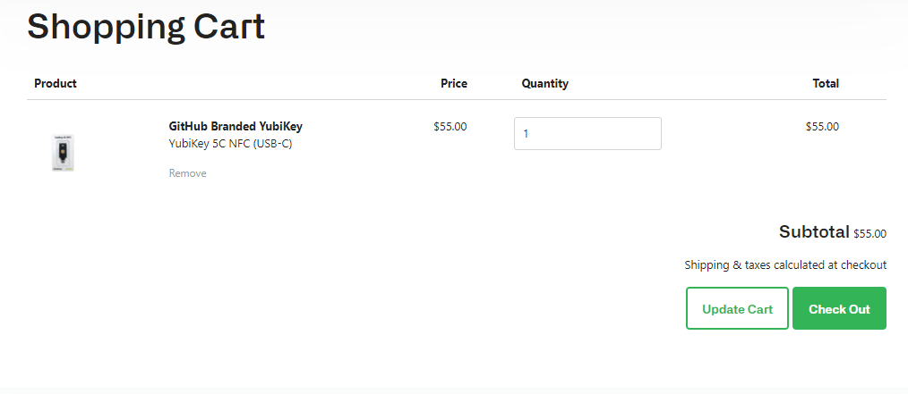
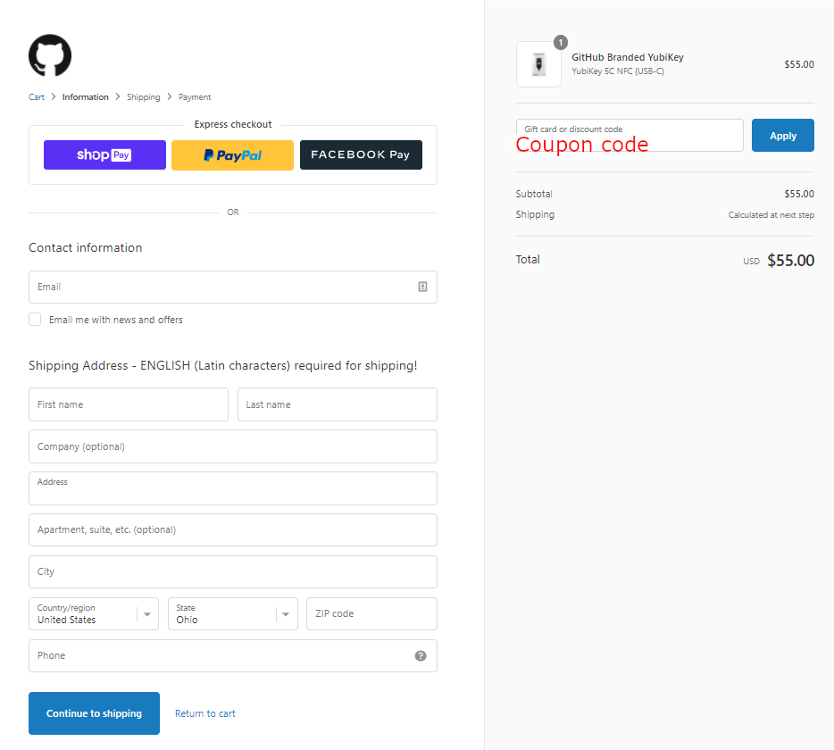

# How to get a Yubikey token from GitHub

Here is how to get an Multi-factor Authentication (MFA) Yubikey
token from GitHub.
Note that tokens are also called "security keys" or "keys".

It's easy.
First, go to the [OpenSSF & GitHub MFA Enablement Form](https://forms.gle/zYLbdmGsgAFbeZr26) to enter your validation code into.
your eligibility to this program via a verification code.

A few days later you will receive a coupon code via email
that will allow you to get
a [GitHub branded Yubikey from their shop](https://thegithubshop.com/products/github-branded-yubikey?_pos=1&_sid=4893867a7&_ss=r)
for free.

One caveat: These tokens are
shipped from the US, so they cannot be shipped to countries if it
is illegal to do so under US law.
Our apologies; we can’t control US law.

## Get started
### Use validation code to get coupon code

To get an MFA Yubikey token from Github, go here:
[OpenSSF & GitHub MFA Enablement Form](https://forms.gle/zYLbdmGsgAFbeZr26)

You will need to enter your email address, your github user name/handle, and the validation code you were provided.

After you accepted to participate in this project, you will receive a coupon code to order your key.

### Use coupon code to "buy" token

You then go to the [GitHub branded Yubikey from their shop](https://thegithubshop.com/products/github-branded-yubikey?_pos=1&_sid=4893867a7&_ss=r) to "buy" the token with the coupon code.

Choose the desired model of key (USB-C or USB-A) and "Add to Cart" to continue.

Next, verify the proper desired token was selected and then "Check-out".

Enter the appropriate information (email address, name, address, etc.).  
Use the coupon code mailed to you and "Apply" it to your order.  This should adjust the price to "$0 USD".

**Important**: Use a shipping address where you have reasonable confidence
that the token will not be tampered with at its destination nor
will tampered with along the way. For most
people, a home or business address is fine.
However, if you're concerned about interception,
consider using a special address (e.g., of someone else you trust).

Press "Continue to Shipping" to confirm the information is correct and complete your order!
